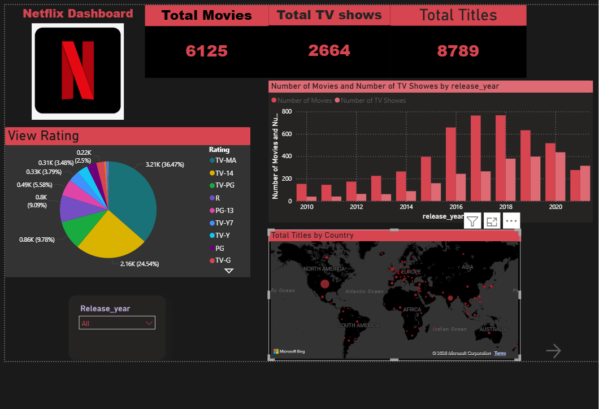

# Netflix-PowerBI-Dashboard
# 🎬 Netflix Content Analysis Dashboard using Power BI

## 📌 Project Overview

This project is an interactive Power BI dashboard built using the Netflix Titles dataset. It provides insights into Netflix's content library by analyzing Movies, TV Shows, Ratings, Release Years, and Country-wise distribution. The dashboard enables users to explore the data through interactive visualizations and filters.

---

## 📷 Dashboard Preview

> Update the image path if your screenshot has a different filename.

---

## 📊 Dashboard KPIs

| KPI | Value |
|------|------:|
| Total Movies | 6,125 |
| Total TV Shows | 2,664 |
| Total Titles | 8,789 |

---

## 📈 Dashboard Features

- 📊 KPI Cards showing total Movies, TV Shows, and Titles
- 🌍 Country-wise content distribution using Map visualization
- 📅 Movies vs TV Shows by Release Year
- 🥧 Content Rating Analysis
- 🎛 Interactive Release Year Slicer
- 📌 Clean Netflix-themed dashboard design

---

## 🛠 Tools & Technologies

- Microsoft Power BI
- Power Query
- DAX (Data Analysis Expressions)
- CSV Dataset

